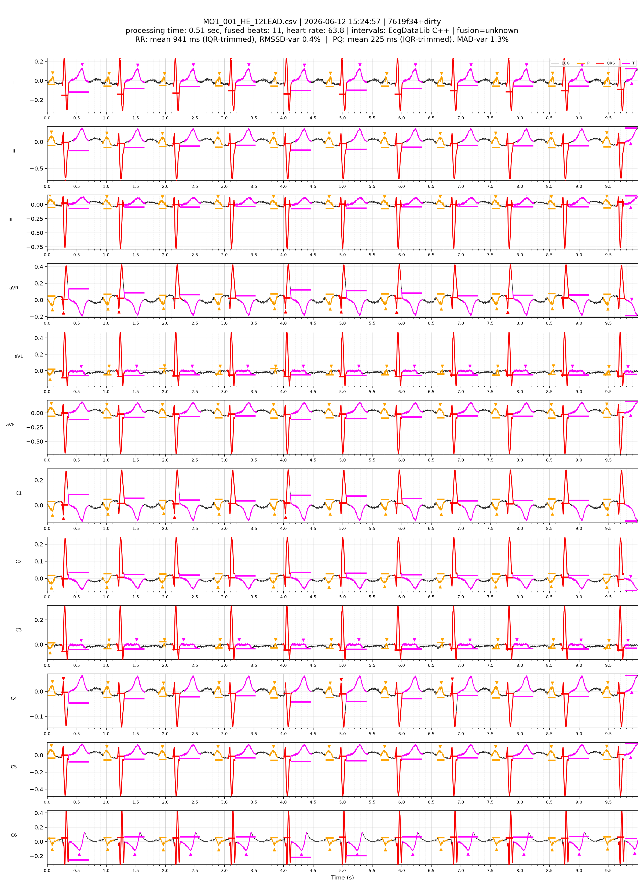
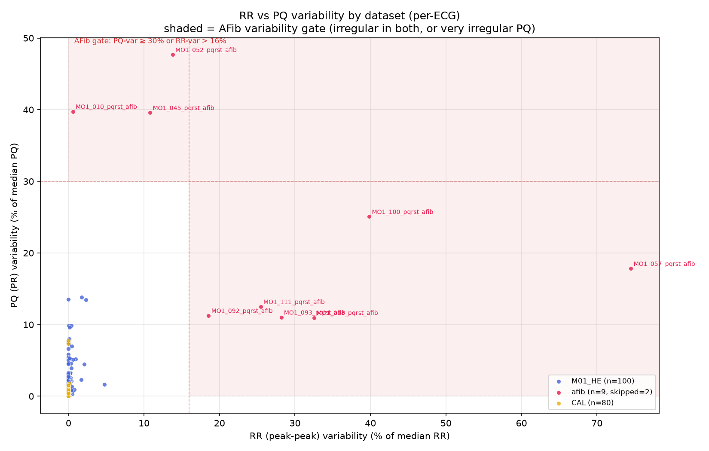
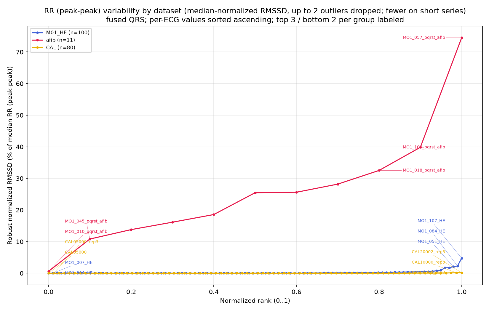
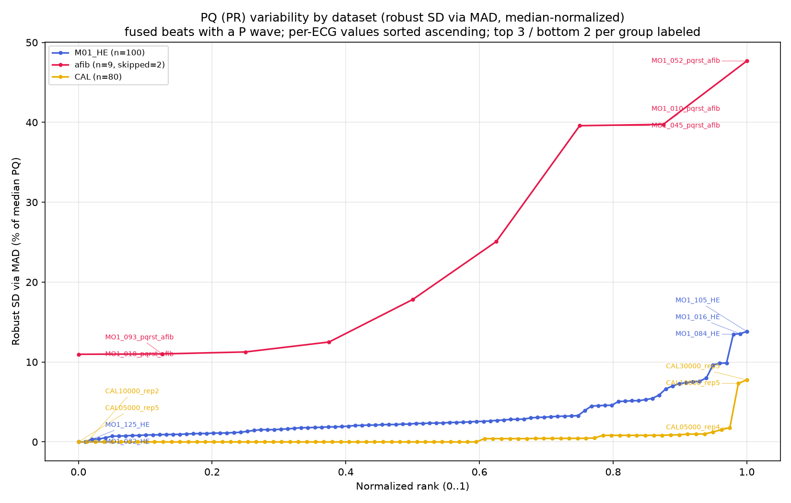

I recently has the pleasure of developing a PQRST delineation algorithm for [HeartEye](https://hearteye.nl).  I got to revive my original [PQRST Paper from 1997](static/20260615-ecg-pqrst/pqrst.pdf) and reimplement it for the 12 lead HeartEye signal together with Bram van Es.

![[static/20260615-ecg-pqrst/ecg-diagram.png|293]]![[P wave area.png|220]]

This algorithm is geometric, and doesn't use AI.  However, AI tools like Cursor and Claude were excellent development partners for code generation, translation, and especially for insightful plots.

The results were satisfyingly accurate.  P and T waves were detected quite well

Irregular rhythms like atrial fibrillation were clearly distinguished by RR and PQ variability.

The "banana" plots rank each dataset's recordings by their variability score
(ascending, normalised to 0–1). The separation is striking — every AFib recording
sits far above the sinus-rhythm population, with very little overlap:

