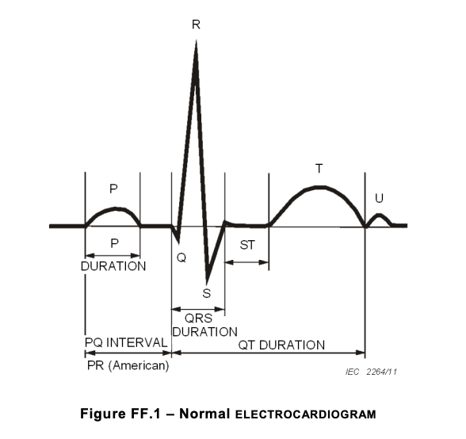
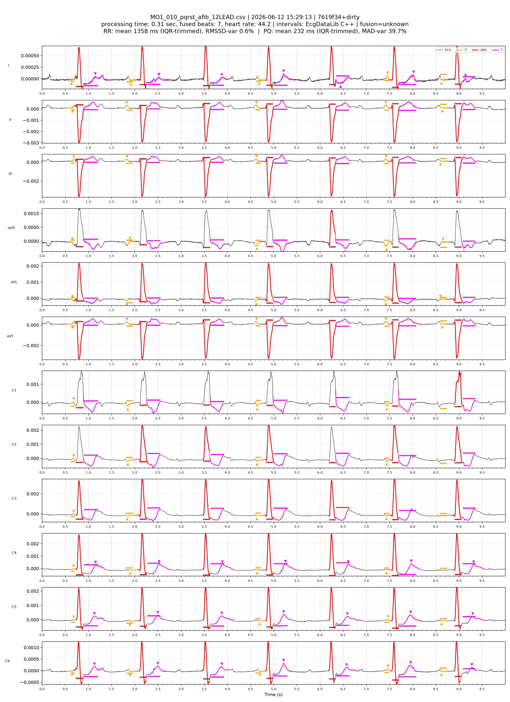

An electrocardiogram (ECG) records the electrical activity of the heart.
Each heartbeat produces a characteristic wave pattern — named **PQRST** after the
letters assigned to each deflection.
The timing of these waves encodes a remarkable amount of diagnostic information:
how fast the heart is beating, how long electrical conduction takes through the
atria and ventricles, and whether the rhythm is regular.

## The PQRST waveform



Each heartbeat traces the following path:

- **P wave** — depolarisation of the atria. Its duration reflects how long the
  electrical impulse takes to spread across both atria.
- **PQ (PR) interval** — conduction delay through the AV node, from start of P
  to start of QRS. Normal range ~120–200 ms.
- **QRS complex** — depolarisation of the ventricles. Duration ~80–120 ms in a
  healthy heart. Widening suggests a conduction block.
- **ST segment** — plateau between ventricular depolarisation and repolarisation.
  Displacement from the baseline is a key indicator of ischaemia.
- **T wave** — ventricular repolarisation.
- **QT interval** — from start of QRS to end of T wave. Rate-corrected QT (QTc)
  prolongation is associated with arrhythmia risk.

## The algorithm

The core PQRST detection algorithm was written in 1997 with Reinhard Illner and
Robert Steacy at Harley Street Software.
The [original paper](static/20260615-ecg-pqrst/pqrst.pdf) describes a
single-lead method; the current implementation fuses detections across all 12 leads.

### QRS detection

QRS complexes are detected first, because the R wave is the largest and sharpest
feature in the signal.

The algorithm computes a smoothed first derivative using the 9-point central
difference of Reddy et al.:

```
d1(i) = x(i-4)/256 - 3x(i-3)/32 - x(i-2)/2 - x(i-1)
       + x(i+1) + x(i+2)/2 + 3x(i+3)/32 + x(i+4)/256
```

This acts as a sharp differentiator up to 20 Hz and a low-pass filter above —
ideal for preserving QRS edges while suppressing baseline wander and
high-frequency noise.
A second derivative `d2 = D(D(x))` is then computed the same way.

A candidate R-wave peak must be a local extremum in `d2`, and the Q-onset to
S-offset span must fall within model bounds. Each candidate is compared against
the previous candidate; the one that better fits the model QRS shape is
accepted and emitted. The detector adapts to arbitrary sampling rates by scaling
the filter window in time.

### P and T wave detection

Once each QRS is localised, the algorithm searches fixed windows in the signal
**before** the QRS (for the P wave) and **after** it (for the T wave),
using the same derivative machinery to find onset, peak, and offset.

### Multi-lead fusion

The current C++ implementation (`EcgDataLib`) runs the detector independently on
each of the 12 leads and fuses the per-beat interval measurements using a
trimmed mean (IQR trimming), discarding outlier beats before computing the
per-recording summary statistics. This makes the result robust to noisy or
artefact-affected leads.

## Example output

The annotated overlay below shows a normal sinus-rhythm recording
(MO1_001, HeartEye dataset). Each beat is labelled with the detected P onset/peak,
QRS onset/peak/offset, and T peak. Coloured markers show the fused intervals
across all 12 leads.


In atrial fibrillation (AFib), the atria fire chaotically. The P wave disappears,
replaced by an irregular, fibrillatory baseline, and the RR intervals become
erratic. The detector correctly identifies QRS and T waves but finds no coherent
P wave:



## AFib detection via RR/PQ variability

Beyond measuring intervals, the algorithm classifies each recording as AFib or
sinus rhythm using two variability metrics:

- **RR variability** — median-normalised RMSSD of the beat-to-beat intervals.
  AFib produces highly irregular RR timing.
- **PQ variability** — robust SD (via MAD) of the per-beat PQ interval,
  normalised to the median. Even when the atria are fibrillating, a P wave is
  sometimes accidentally detected on a noise peak, but the PQ interval will jump
  around inconsistently.

A recording is flagged AFib if **RR-var > 16%** or **PQ-var ≥ 30%**, or if a
coherent P wave is found on fewer than 60% of beats.

The scatter plot below shows RR variability (x-axis) vs PQ variability (y-axis)
for all recordings. The shaded region is the AFib gate. Normal sinus (blue) and
calibration (yellow) cluster near zero; AFib recordings (red) fall cleanly inside
the gate:


The "banana" plots rank each dataset's recordings by their variability score
(ascending, normalised to 0–1). The separation is striking — every AFib recording
sits far above the sinus-rhythm population, with no overlap:


## Accuracy

The detector has been validated against the [IEC 60601-2-25:2015](https://webstore.iec.ch/en/publication/2593)
standard test suite (CSE dataset, 100 biological + 95 calibration recordings):
all interval aggregates (P-dur, PQ, QRS, QT mean and SD) fall within the M01 and
CAL tolerances, and all 11 AFib stems are correctly flagged.
See the [original paper](static/20260615-ecg-pqrst/pqrst.pdf) for the
earlier single-lead validation results on the MIT-BIH arrhythmia database.
