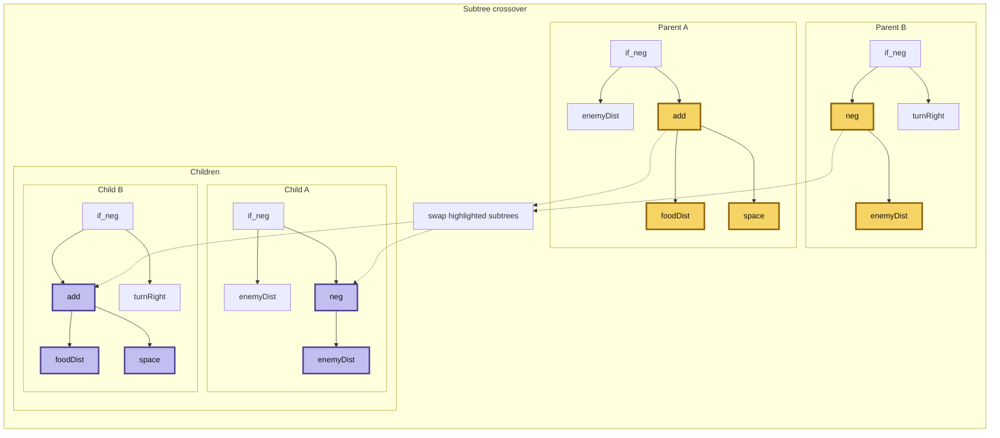

This was my entry for the AI
[Battlesnake](https://play.battlesnake.com/) competition in
2017.  Battlesnake is an AI competition where snakes move around an
arena looking for food and trying to avoid collisions with walls,
other snakes, and themselves.  Last one slithering wins.

I decided to try
[genetic programming](https://en.wikipedia.org/wiki/Genetic_programming) instead of neural nets.
For a good reference, see
[A Field Guide to Genetic Programming](/static/site/docs/a_field_guide_to_genetic_programming.pdf).
My evolved snakes did
well in competition, and I loved seeing them evolve original and
surprising behaviour that I wouldn't have programmed myself.

<div>
<a href="/static/site/pages/battlesnakes/" data-router-ignore>
See them in action!

</a>
</div>

The training loop looked like this:

1. Start with a population of random "genomes".
2. Play them off against each other.
3. Select the fittest.
4. Breed a new generation by randomly mixing the fittest genomes with some mutations.
5. Repeat.

## Interesting Observations

1. Snakes learned original behaviour that I would not have predicted
   or thought to code for.
2. My biggest problem with the genetic algorithm was inbreeding. When a winner
   genome appeared it would repeat and fill the whole population, so I needed
   to keep some losers and mutants around to keep the gene pool diverse.
3. They evolved too cooperatively! When I trained them all together they
   learned to share food with each other and were not competitive enough. I had
   to keep some hard-coded greedy predators in each generation so they always
   had something to compete with.

## Technical Details

### Combining Parent Expressions

Each snake's "genome" is a mathematical expression that takes a set of senses
as input and outputs a direction to move at each step.

To breed a new genome, swap random subtrees from each parent and add
some mutation.



### Sense Maps

The inputs to the genome expression are a set of "senses" I called
smell maps.  For example, the shortest distance to food or other
snakes. Starting from every food cell or enemy cell, the code runs a
breadth-first flood fill and stores the number of moves to the nearest
source. Close food is good, and cells with enemy distance less than or
equal to 1 are heavily penalized.

Enemy distance map:

```text
4 3 2 3 4
3 2 1 2 3
2 1 E 1 2
3 2 1 2 3
4 3 2 3 4
```

Food distance map:

```text
2 1 2 3 4
1 F 1 2 3
2 1 2 3 4
3 2 3 4 5
4 3 4 5 6
```

## Conclusion

The core technique of genetic programming is defining a genome and the splicing
reproduction function. The art is in managing the mutation rate, avoiding
inbreeding, and maintaining a challenging environment to evolve in.

## Update 2026

Next I would like to try these ideas against some modern reinforcement
learning techniques. Maybe use genetic algorithms to help build or
tune the RL neural network pipeline.

[Git repo](https://github.com/noelbk/genetisnake).
