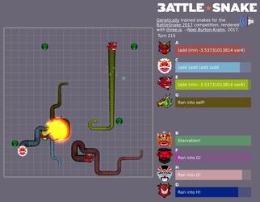
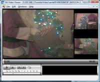
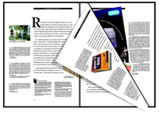
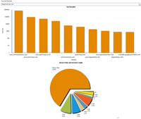

## Noel Burton-Krahn — code samples

Here are some samples of my own code from favourite past projects.

- [Resume PDF](static/NoelBurtonKrahnResume.pdf)
- [GitHub](https://github.com/noelbk)

### Genetisnake (genetic programming, Three.js, Phoenix)

Battlesnake is an AI competition where snakes compete to survive on a simple board. My entry used [genetic programming](https://en.wikipedia.org/wiki/Genetic_programming). I rendered the board with [Three.js](https://threejs.org/), and the game server was a multi-room chat application written in [Phoenix](http://www.phoenixframework.org/).

### GKViewer Video Recording and Playback (C++, OpenGL, ActiveX)

This was a multi-camera digital video recording and playback system. The code cross-compiled on Linux and Windows to save and display video on a Linux recording unit, and to play back on Windows through an ActiveX component written in C++ using OpenGL.

- Main class for the player: [`glplayer.h`](static/glplayer.h), [`glplayer.cpp`](static/glplayer.cpp)
- GLActor for video: [`glactorvideo.h`](static/glactorvideo.h), [`glactorvideo.cpp`](static/glactorvideo.cpp)
- ActiveX wrapper: [`GLPlayerCtlCtrl.h`](static/GLPlayerCtlCtrl.h), [`GLPlayerCtlCtrl.cpp`](static/GLPlayerCtlCtrl.cpp)
- Real-time scheduling: [`task.h`](static/task.h), [`task.cpp`](static/task.cpp)

### Hotswap — Transparent Failover for Linux (C++, linux kernel)

My Master's project was to replicate Linux process trees between servers, so one server could seamlessly take over from another without losing data or breaking network connections.

- [LISA'02 paper](lisa02.pdf)

### Page Flipping (Java, OpenGL)

This is a Java applet I worked on as a prototype for a photo album application.

`Planed.java` computes a transformation matrix for flipping the OpenGL model matrix across a plane:

- [`Planed.java`](static/pageapplet/Planed.java)

### P2PVPN (C/C++, wxWidgets)

P2PVPN is a peer-to-peer firewall-tunneling VPN. It connects peer computers through firewalls like Skype does, but instead of voice conferencing, P2PVPN creates a virtual ethernet interface and gives peers virtual IP addresses for each other.

- Client daemon: [`p2p_peer.h`](static/p2p_peer.h), [`p2p_peer.c`](static/p2p_peer.c)
- Desktop UI: [`p2p_ui_frame.h`](static/p2p_ui_frame.h), [`p2p_ui_frame.cpp`](static/p2p_ui_frame.cpp)
- Library: [wxWidgets](http://wxwidgets.org/)

### Web Server / Database Applications

Most of my bread and butter work is making web servers and distributed systems with Python ([`djselect.py`](static/djselect.py), [`expand.py`](static/expand.py)), C#, Groovy, Java, Erlang, Phoenix, Django.

Cloud computing and devops: AWS, Docker, Kubernetes, consul, etcd.  
Databases: MySQL, PostgreSQL, SQL Server, DB2  
Version control: Git, Subversion, Mercurial

